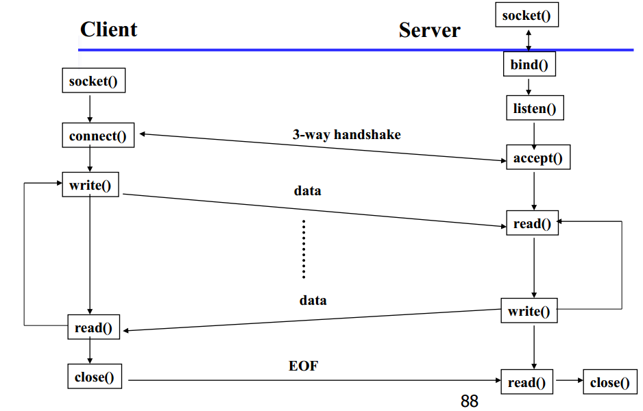

# 2019 年春研究生《高级操作系统》知识点
## 一． 分布式系统特征
### 1. 什么叫分布式系统？举例说明现实生活中的分布式系统，阐述系统组成部分与功能特点。---songjn
答：分布式系统是一个硬件或软件组件分布在不同的网络计算机上，通过消息传递进行通信和协调的系统。

**举例 - Web搜索**

·        底层物理设施，它由超大数目的位于全世界多个数据中心的联网计算机组成；

·        分布式文件系统，支持超大文件，并根据搜索和其他应用的使用方式（特别是在文件中以快速而持久的速度读取）进行了深度优化；

·        相关的结构化分布式存储系统，它提供对超大数据集的快速访问；

·        锁服务，它提供诸如分布式加锁和协定等分布式系统功能；

·        编程模式，它支持对底层物理基础设施上的超大并行和分布式计算的管理。


### 2. 分布式系统的特征是什么？--ziyu
### 3. 给出能被共享的 5 种类型的硬件资源和 5 种类型的数据或软件资源。给出它们在实际的分布式系统中发生共享的例子。
### 4. 在分布式系统中，常常说，“避免性能瓶颈”。可否举例说明并谈谈你的观点。
### 5. 在故障处理（ Failure handling）中，什么叫容错？什么叫冗余？ -- Sunyang

解： `pdf`中未给出定义，一下定义来自`wiki`

* 容错： 容错性是指软件检测应用程序所运行的软件或硬件中发生的错误并从错误中恢复的能力，使系统能够在某些组件发生故障（或其中的一个或多个故障）时继续正常运行。
* 冗余： 人为增加地重复部分，其目的是用来对原本的单一部分进行备份，以达到增强其安全性的目的。

### 6. 现今分布式操作系统的挑战有： Heterogeneity（异构性）， Openness（开放性）， Security（安全性）， Scalability（可伸缩性）， Failure handling（故障处理）， Concurrency（并发性）， Transparency（透明性），等。分别给出挑战的定义，举例与详细分析挑战涉及的关键技术。---songjn

一：异构性。网络、计算机硬件、操作系统、编程语言、由不同的开发者完成的软件实现都是造成异构性的主因。其中网络的异构通过互联网协议相互通信而被屏蔽；中间件的流行屏蔽的底层网络、硬件、操作系统和编程语言的异构，它为分布式应用和服务器提供了一直的计算模型，包括RPC、远程事件通知、远程SQL访问和分布式事物调用；虚拟机也是使代码到处运行的一种方法。

二：开放性。它取决于新的资源共享服务能被增加和供多种客户程序使用的程度。特征就是发布系统的关键接口，使其基于一致的通信机制，让不同提供商提供异构硬件和软件。

三：安全性。包括三个部分：机密性（防止泄露给未授权的个人）、完整性（防止被改变或被破坏）、可用性（防止对访问资源的手段的干扰）。其中有两个重要的安全问题：拒绝服务攻击和移动代码的安全性仍然没有得到圆满解决。

四：可伸缩性。顾名思义就是随着资源数量的增加和用户访问的增加，系统仍然能保持其有效性，该系统就被称为可伸缩的。其中有控制物理资源的开销、控制性能损失、防止软件资源用尽和避免性能瓶颈四大挑战。

五：故障处理。在一个分布式系统中，硬件或软件都会出现未知的故障或者不正常运行，因此故障处理是贯穿整个系统的难题。容错（设计容错机制如重传）、故障恢复（数据恢复或“回滚”保证一致性）、冗余（多条路由或者备份等技术）都是故障处理技术。

六：并发性。多个用户对同一资源的使用，要保持操作的正确性就必须在数据保持一致的基础上同步。如使用操作系统的信号量。

七：透明性。

    1. 访问透明性：用相同的操作访问本地资源和远程资源（电子邮件）

    2. 位置透明性：不需要知道资源的物理位置或网络位置（电子邮件、URL）

    3. 并发透明性：几个进程能并发的使用共享资源而不互相干扰

    4. 复制透明性：使用资源的多个实例提升可靠性和性能，而用户和程序员无需知         道副本的相关信息

    5. 故障透明性：屏蔽错误

    6. 移动透明性：资源和客户能够在系统内移动而不受影响（移动电话）

    7. 性能透明性：负载变化时，系统能够被重新配置以提高性能

    8. 伸缩透明性：系统和应用能够进行扩展而不改变系统结构和应用算法
## 二． 系统模型
### 1. 分布式系统模型设计时，设计者常常面对的分布式系统的困难与威胁问题有哪些？--QiuyanZhang
### 2. 分布式系统体系结构元素包括：通信实体、通信范型、角色和责任、放置，以客户-服务器系统体系结构为例解释相应元素概念。--QiuyanZhang
### 3. 什么叫层次化软件体系结构？举例说明。--ziyu
### 4. 什么叫瘦客户？举例说明你的观点。--QiuyanZhang
### 5. 举例说明并图示异步分布式系统中，不同网络结点间进程的“事件的实时排序”。（参考图 2-13）
### 6. 掌握分布式系统的设计实例， 分布式系统的基础模型有哪些？分别可以解决哪些问题？ --QiuyanZhang
## 三． 进程间通信
### 1. 线程与进程的区别？ -- Sunyang


解：

线程与进程的定义如下:

* 线程:  线程是操作系统能够进行运算调度的最小单位。 它被包含在进程之中，是进程中的实际运作单位。
* 进程:  进程是具有独立功能的程序关于某个数据集合上的一次运行活动，是系统进行资源分配和调度的独立单位。

区别:  两者完成的工作不同，**线程**用于小任务，而**进程**用于更多的'重量级'的任务- 应用基本执行。


### 2. 什么是进程、线程的并发控制与调度？什么是多线程并发控制？ --Wangtao

### 3. 什么是进程间通信？什么是消息传递？给出定义并举例说明。--ziyu
### 4. 什么是客户/服务器编程？如何进行客户端编程设计？如何进行服务器端编程设计？如何设计服务器与客户的通信？给出基于 Socket 的客户/服务器，面向 UDP 和 TCP 网络编程的详细说明，同时给出一个 UNIX/Linux的 Client/Sever 的程序设计算法流程图。---songjn
什么是客户/服务器编程

从硬件角度看，客户/服务器体系结构是指将某项任务在两台或多台机器之间进行分配，其中客户机（Client）用来运行提供用户接口和前端处理的应用程序，服务器机（Server）提供客户机使用的各种资源和服务。

从软件角度看，客户/服务器体系结构是把某项应用或软件系统按逻辑功能划分为客户软件部分和服务器软件部分。客户软件部分一般负责数据的表示和应用，处理用户界面，用以接收用户的数据处理请求并将之转换为对服务器的请求，要求服务器为其提供数据的存储和检索服务；服务器端软件负责接收客户端软件发来的请求并提供相应服务。
客户/服务器融合了大型机的强大功能和中央控制以及PC机的低成本和较好的处理平衡。客户/服务器为任务的集中/局部分布提供了一种新的方法，这种体系能够使用户对数据完整性、管理和安全性进行集中控制。在缓解网络交通和主机负荷以及满足用户需要方面，客户/服务器体系提供了良好的解决方案。
总之，客户/服务器的工作模式是：客户与服务器之间采用网络协议（如TCP/IP、IPX/SPX）进行连接和通讯，由客户端向服务器发出请求，服务器端响应请求，并进行相应服务。




## 四． 远程过程调用
### 1. 什么叫远程过程调用？ 举例说明。 -- Sunyang


解：

名词解释：

* 远程过程调用：即RPC(Remote Procedure Call) 指用户可以向调用本地过程一样调用不同地域的不同计算机上的过程，从而使得应用程序设计人员不必设计和开发有关发送和接收信息的实现细节，体现了分布式系统的透明性.

举例：用户使用移动端设备买票，执行抢票动作的机器可能在北京可能在上海，移动设备可以直接通过协议远程调用买票的指令且不用关心远端机房具体的位置。


### 2. 描述远程过程调用 RPC 的工作原理和 RPC 调用的步骤。 --Wangtao

### 3. 描述远程过程调用通信模型。
### 4. 使用 socket 编程实现一个简单的远程过程调用流程设计，文件系统存放在远端服务器上，要求： -- Sunyang
  1、客户端程序实现 put 功能(将一个文件从本地传到文件服务器) ； put[-h hostname] [-p portname] local_filename remote_filename  
  2、客户端程序实现 get 功能(从文件服务器取一远程文件存到本地客户端)。注意：客户端和文件服务器不在同一台机器上。get [-h hostname] [-p portname] remote_filename local_filename

解:

**伪代码实现**

Client

```
function put(server_ip, server_port, local_file_path) {
  //register socket connection
  Socket socket = new Socket()
  socket.connect(server_ip, server_port)

  //add socket read data closure
  socket.read_data(void(Data readData){
    if (readData.is_upload_ack) {
      socket.close()
    }
  })
 
  //process upload file
  File file = new File(local_file_path)
  Data fileData = new Data(file)

  // send file data
  socket.write(fileData)
}
```

Server

```
function get(host_ip, host_port, file_storage_path) {
  // bind socket
  Socket socket = new Socket()
  socket.bind(host_ip, host_port)

  // add socket read data closure
  socket.read_data(void(Data readData){
    if (readData.is_upload_req) {
      File file = new File(readData)
      // save file
      file.sync(file_storage_path)
      Data upload_ack_data = new Data()

      // send ack
      socket.write(upload_ack_data)

      // close
      socket.close()
    }
  })

  // listen
  while(true) {
    socket.listen(void(remote_ip) {
      socket.accept()
    })
  }

}
```


## 五． 操作系统支持
### 1. 什么叫虚拟机？ 什么叫虚拟化？举例说明。 --Wangtao
### 2. 什么叫保护？举例说明。  --Wangtao
### 3. 什么叫进程调度？什么叫线程调度？ 多线程并发处理？  --Wangtao
### 4. 什么叫临界区？什么叫临界资源？如何解释线程同步？ --Wangtao
### 5. 单处理机进程调度算法有哪些？如何描述？--ziyu
### 6. 影响远程调用的哪些因素会影响消息传递？
### 7. 举例说明在分布式环境下，什么是代码迁移？ -- Sunyang

解:

定义：将程序(或执行中的程序)传递到其它计算机。

举例：如大型电商活动中，远端机器A的负责计算优惠信息的进程 被机器B(负责展示)和机器C(负责交易)频繁访问，则可以将计算优惠信息的进程通过代码迁移，迁移到机器B和C下进行，减小机器A的压力，同时提高B和C的响应速度


### 8. 举例说明在分布式环境下的处理器任务分配。比较与单处理机分配的不同？
## 六． 同步化
### 1. 什么是物理时钟的同步算法？---songjn
### 2. 什么是基于逻辑时钟的同步算法？---songjn
### 3. 如何进行一致性全局状态的检测？--ziyu
### 4. 什么是选举算法？
### 5. 什么是互斥算法？
### 6. 如何进行分布式系统的死锁处理？
## 七． 分布式文件系统*(选做——思考题)
### 1. 分布式文件系统的特点与需求是什么？
### 2. Sun 网络文件系统（ NFS）的自动安装器是如何改进 NFS 的性能和可伸缩性的？
## 八． 分布式系统前沿与案例分析（ + 聂慧静老师）
### 1. 什么是大数据？ 什么是云平台？举例说明它们的关系。
### 2. 什么是网格？网格平台与云平台的联系与区别？--QiuyanZhang
### 3. 案例分析题，以保险公司案例为背景回答下列问题：
  1、传统 BI 的关键技术包括哪些，分别详细描述。  
  2、 描述一下保险行业大数据四层架构，大数据在保险行业的应用场景有哪些，选择一个案例详细描述。  
  3、 描述云服务架构的三个层次分别是什么？保险企业一般重点开发建设的是哪个层次的云架构？  
  4、 分布式系统中， 手机端应用案例的后台架构图中，有哪些关键模块，分别的作用是什么？  
