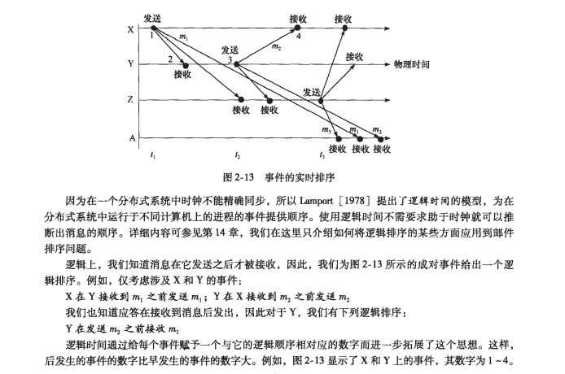
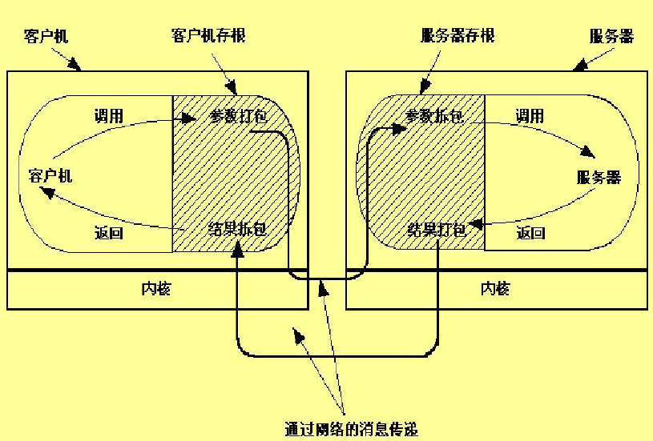
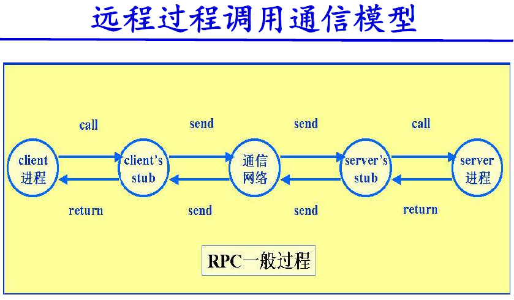

# 2019 年春研究生《高级操作系统》知识点
## 一． 分布式系统特征
### 1. 什么叫分布式系统？举例说明现实生活中的分布式系统，阐述系统组成部分与功能特点。---songjn
答：分布式系统是一个硬件或软件组件分布在不同的网络计算机上，通过消息传递进行通信和协调的系统。

**举例 - Web搜索**
* 底层物理设施，它由超大数目的位于全世界多个数据中心的联网计算机组成；    
* 分布式文件系统，支持超大文件，并根据搜索和其他应用的使用方式（特别是在文件中以快速而持久的速度读取）进行了深度优化；  
* 相关的结构化分布式存储系统，它提供对超大数据集的快速访问；    
* 锁服务，它提供诸如分布式加锁和协定等分布式系统功能；    
* 编程模式，它支持对底层物理基础设施上的超大并行和分布式计算的管理。   


### 2. 分布式系统的特征是什么？--ziyu
* 并发性 - 程序通过共享资源并行  
* 缺乏全局时钟 - 分布式系统中的计算机只能通过本地时钟交换消息；不可预测的消息延迟限制了准确性；没有一个全局时钟的概念。  
* 故障独立性 - 计算机中的故障或程序中的异常马上不能被与之通讯的其他组件感知；系统设计者需要为故障处理做计划。  

### 3. 给出能被共享的 5 种类型的硬件资源和 5 种类型的数据或软件资源。给出它们在实际的分布式系统中发生共享的例子。
* 硬件资源: 硬盘、 cpu、  gpu、  内存、  打印机  
* 5种数据或软件： 视频、 图片 、文档、 可执行程序、 html  
* 举例：打印机共享，接受并处理来自一个以上计算机的打印任务。通过将打印机物料地连接到服务器上，并在打印机服务器上安装合适的打印机驱动程序，然后将打印机在网络上共享，共享依赖于NOS。


### 4. 在分布式系统中，常常说，“避免性能瓶颈”。可否举例说明并谈谈你的观点。

由于服务和数据分布在不同的机器上，每次交互都需要跨机器运行，会导致网络延迟和网络故障，使系统整体性能降低，会带来一系列的问题，比如资源的锁住，所以系统调用一般都要设置一个超时时间进行自我保护，但是过度的延迟就会带来系统的RPC调用超时，引发一个令人头疼的问题：分布式系统调用的三态结果：成功、失败、超时。不要小看这个第三态，这几乎是所有分布式系统复杂性的根源。要避免这样的性能瓶颈，有一些相应的解决方案：异步化，失败重试。 而对于跨IDC数据分布带来的巨大网络因素影响，则一般会采用数据同步，代理专线等处理方式。

### 5. 在故障处理（ Failure handling）中，什么叫容错？什么叫冗余？ -- Sunyang

解： `pdf`中未给出定义，一下定义来自`wiki`

* 容错： 容错性是指软件检测应用程序所运行的软件或硬件中发生的错误并从错误中恢复的能力，使系统能够在某些组件发生故障（或其中的一个或多个故障）时继续正常运行。
* 冗余： 人为增加地重复部分，其目的是用来对原本的单一部分进行备份，以达到增强其安全性的目的。


### 6. 现今分布式操作系统的挑战有： Heterogeneity（异构性）， Openness（开放性）， Security（安全性）， Scalability（可伸缩性）， Failure handling（故障处理）， Concurrency（并发性）， Transparency（透明性），等。分别给出挑战的定义，举例与详细分析挑战涉及的关键技术。---songjn

一：异构性。网络、计算机硬件、操作系统、编程语言、由不同的开发者完成的软件实现都是造成异构性的主因。其中网络的异构通过互联网协议相互通信而被屏蔽；中间件的流行屏蔽的底层网络、硬件、操作系统和编程语言的异构，它为分布式应用和服务器提供了一直的计算模型，包括RPC、远程事件通知、远程SQL访问和分布式事物调用；虚拟机也是使代码到处运行的一种方法。

二：开放性。它取决于新的资源共享服务能被增加和供多种客户程序使用的程度。特征就是发布系统的关键接口，使其基于一致的通信机制，让不同提供商提供异构硬件和软件。

三：安全性。包括三个部分：机密性（防止泄露给未授权的个人）、完整性（防止被改变或被破坏）、可用性（防止对访问资源的手段的干扰）。其中有两个重要的安全问题：拒绝服务攻击和移动代码的安全性仍然没有得到圆满解决。

四：可伸缩性。顾名思义就是随着资源数量的增加和用户访问的增加，系统仍然能保持其有效性，该系统就被称为可伸缩的。其中有控制物理资源的开销、控制性能损失、防止软件资源用尽和避免性能瓶颈四大挑战。

五：故障处理。在一个分布式系统中，硬件或软件都会出现未知的故障或者不正常运行，因此故障处理是贯穿整个系统的难题。容错（设计容错机制如重传）、故障恢复（数据恢复或“回滚”保证一致性）、冗余（多条路由或者备份等技术）都是故障处理技术。

六：并发性。多个用户对同一资源的使用，要保持操作的正确性就必须在数据保持一致的基础上同步。如使用操作系统的信号量。

七：透明性。

    1. 访问透明性：用相同的操作访问本地资源和远程资源（电子邮件）

    2. 位置透明性：不需要知道资源的物理位置或网络位置（电子邮件、URL）

    3. 并发透明性：几个进程能并发的使用共享资源而不互相干扰

    4. 复制透明性：使用资源的多个实例提升可靠性和性能，而用户和程序员无需知         道副本的相关信息

    5. 故障透明性：屏蔽错误

    6. 移动透明性：资源和客户能够在系统内移动而不受影响（移动电话）

    7. 性能透明性：负载变化时，系统能够被重新配置以提高性能

    8. 伸缩透明性：系统和应用能够进行扩展而不改变系统结构和应用算法
## 二． 系统模型
### 1. 分布式系统模型设计时，设计者常常面对的分布式系统的困难与威胁问题有哪些？--QiuyanZhang
* （1）使用模式的多样性：
```
系统组件承受各种工作负载，例如：Web每天有几百万的访问量
系统断线或连接不稳定，例如：系统中包括移动计算机
系统对带宽与延迟的特殊要求，例如：多媒体应用
```
* （2）系统环境的多样性：
```
容纳异构硬件、操作系统和网络，网络在性能上有很大的不同，例如：无线网的速度只达到局域网的几分之一
支持不同规模的系统，从几十台计算机到几百万台计算机
```
* （3）内部问题：
```
非同步时钟
冲突的数据更新
系统组件的软硬件故障
```
* （4）外部问题：
```
数据完整性
保密性的攻击
服务拒绝攻击
```

### 2. 分布式系统体系结构元素包括：通信实体、通信范型、角色和责任、放置，以客户-服务器系统体系结构为例解释相应元素概念。--QiuyanZhang
* 通信实体-客户端与服务器端的通信（对象，组件，web服务），底层进程间的通信。
* 通信范型-分布式系统中实体如何通信。客户-服务器结构中最常见的通信范型是远程调用，如用于支持客户-服务器计算的请求-应答协议是一个有效的模式。
* 角色和责任-在客户-服务器结构中，进程扮演服务器和客户的角色。特别是，为了访问服务器管理的共享资源，客户进程可以与不同主机上的服务器进行交互。
* 放置-对象或服务这样的实体是怎样映射到底层的物理分布式基础设施上的，物理分布式基础设施由大量的机器组成，这些机器通过一个任意复杂的网络互联。从决定分布式系统特性的角度而言，放置是关键的，这些特性大多数与性能相关，也包括其他特性如可靠性和安全性。放置需要考虑实体间的通信模式、给定机器的可靠性和它们当前的负载、不同机器之间的通信质量等。


### 3. 什么叫层次化软件体系结构？举例说明。--ziyu
层次化体系结构与分层体系结构是互补的，分层将服务垂直组织成抽象层，而层次化是一项组织给定层功能的技术，
它把这个功能放在合适的服务器上，或者作为第二选择放在物理节点上。
三层层次体系结构: 显示层、应用层、永久数据存储层


### 4. 什么叫瘦客户？举例说明你的观点。--QiuyanZhang
瘦客户是指一个软件层，它支持用户端的计算机上基于窗口的用户界面，
而在远程的计算机上执行应用程序。廋客户可能通过大量的网络化服务和潜在能力极大地增加简单的本地设备，
例如，智能电话和其他资源有限的设备。缺点：在交互频繁的图形活动中，因为网络和操作系统延迟，而变得不可接受。


### 5. 举例说明并图示异步分布式系统中，不同网络结点间进程的“事件的实时排序”。（参考图 2-13）



### 6. 掌握分布式系统的设计实例， 分布式系统的基础模型有哪些？分别可以解决哪些问题？ --QiuyanZhang
* 1）交互模型-交互模型处理分布式系统中性能以及设置时间限制的困难，例如对于消息传递。反映了进程交互的方式；
* 2）故障模型-故障模型试图给出由进程和通信通道呈现出来的故障的一个精确的规格说明。它定义可靠的通信和正确的进程；
* 3）安全模型-安全模型讨论对于进程和通信通道可能存在的威胁，它引入了安全通道的概念，以低于这些威胁。


## 三． 进程间通信
### 1. 线程与进程的区别？ -- Sunyang


解：

线程与进程的定义如下:

* 线程:  线程是操作系统能够进行运算调度的最小单位。 它被包含在进程之中，是进程中的实际运作单位。
* 进程:  进程是具有独立功能的程序关于某个数据集合上的一次运行活动，是系统进行资源分配和调度的独立单位。

区别:  两者完成的工作不同，**线程**用于小任务，而**进程**用于更多的'重量级'的任务- 应用基本执行。


### 2. 什么是进程、线程的并发控制与调度？什么是多线程并发控制？ --Wangtao
进程调度-操作系统管理了系统有限资源，当有多个进程（或多个进程发出的请求）要使用这些资源时，因为资源有限性，必须按照一定的原则选择进程（请求）来占用资源，这就是调度。
线程调度-指按照特定机制为多个线程分配CPU的使用权。
多线程并发控制-是指从软件或者硬件上实现多个线程并发执行的技术。具有多线程能力的计算机因有硬件支持而能够在同一时间执行多于一个线程，进而提升整体处理性能。

### 3. 什么是进程间通信？什么是消息传递？给出定义并举例说明。--ziyu
进程间通信：指进程间的信息交换，其所交换的信息量，少则只是一个状态或一个数值，多则可能是成千上万个字节。
管道通信：即发送进程以字符流形式将大量数据送入管道，接收进程可从管道接收数据，二者利用管道进行通信。
消息队列：是在消息的传输过程中保存消息的容器。
信号量机制：即利用PV操作来对信号量进行处理。
共享内存：在多处理器的计算机系统中，可以被不同中央处理器（CPU）访问的大容量内存。

### 4. 什么是客户/服务器编程？如何进行客户端编程设计？如何进行服务器端编程设计？如何设计服务器与客户的通信？给出基于 Socket 的客户/服务器，面向 UDP 和 TCP 网络编程的详细说明，同时给出一个 UNIX/Linux的 Client/Sever 的程序设计算法流程图。---songjn
什么是客户/服务器编程

从硬件角度看，客户/服务器体系结构是指将某项任务在两台或多台机器之间进行分配，其中客户机（Client）用来运行提供用户接口和前端处理的应用程序，服务器机（Server）提供客户机使用的各种资源和服务。

从软件角度看，客户/服务器体系结构是把某项应用或软件系统按逻辑功能划分为客户软件部分和服务器软件部分。客户软件部分一般负责数据的表示和应用，处理用户界面，用以接收用户的数据处理请求并将之转换为对服务器的请求，要求服务器为其提供数据的存储和检索服务；服务器端软件负责接收客户端软件发来的请求并提供相应服务。
客户/服务器融合了大型机的强大功能和中央控制以及PC机的低成本和较好的处理平衡。客户/服务器为任务的集中/局部分布提供了一种新的方法，这种体系能够使用户对数据完整性、管理和安全性进行集中控制。在缓解网络交通和主机负荷以及满足用户需要方面，客户/服务器体系提供了良好的解决方案。
总之，客户/服务器的工作模式是：客户与服务器之间采用网络协议（如TCP/IP、IPX/SPX）进行连接和通讯，由客户端向服务器发出请求，服务器端响应请求，并进行相应服务。


## 四． 远程过程调用
### 1. 什么叫远程过程调用？ 举例说明。 -- Sunyang


解：

名词解释：

* 远程过程调用：即RPC(Remote Procedure Call) 指用户可以向调用本地过程一样调用不同地域的不同计算机上的过程，从而使得应用程序设计人员不必设计和开发有关发送和接收信息的实现细节，体现了分布式系统的透明性.

* 举例：用户使用移动端设备买票，执行抢票动作的机器可能在北京可能在上海，移动设备可以直接通过协议远程调用买票的指令且不用关心远端机房具体的位置。

### 2. 描述远程过程调用 RPC 的工作原理和 RPC 调用的步骤。 --Wangtao



**远程过程调用步骤**  

客户过程以正常的方式调用客户存根 
* 客户存根生成一个消息，然后调用本地操作系统 
* 客户端操作系统将消息发送给远程操作系统 
* 远程操作系统将消息交给服务器存根 
* 服务器存根将参数提取出来，然后调用服务器 
* 服务器执行要求的操作，操作完成后将结果返回给服务器存根 
* 服务器存根将结果打包成一个消息，然后调用本地操作系统 
* 服务器操作系统将含有结果的消息发送回客户端操作系统 
* 客户端操作系统将消息交给客户存根 
* 客户存根将结果从消息中提取出来，返回给调用它的客户过程 


### 3. 描述远程过程调用通信模型。


### 4. 使用 socket 编程实现一个简单的远程过程调用流程设计，文件系统存放在远端服务器上，要求： -- Sunyang
  1、客户端程序实现 put 功能(将一个文件从本地传到文件服务器) ； put[-h hostname] [-p portname] local_filename remote_filename  
  2、客户端程序实现 get 功能(从文件服务器取一远程文件存到本地客户端)。注意：客户端和文件服务器不在同一台机器上。get [-h hostname] [-p portname] remote_filename local_filename

解:

**伪代码实现**

Client

```
function put(server_ip, server_port, local_file_path) {
  //register socket connection
  Socket socket = new Socket()
  socket.connect(server_ip, server_port)

  //add socket read data closure
  socket.read_data(void(Data readData){
    if (readData.is_upload_ack) {
      socket.close()
    }
  })
 
  //process upload file
  File file = new File(local_file_path)
  Data fileData = new Data(file)

  // send file data
  socket.write(fileData)
}
```

Server

```
function get(host_ip, host_port, file_storage_path) {
  // bind socket
  Socket socket = new Socket()
  socket.bind(host_ip, host_port)

  // add socket read data closure
  socket.read_data(void(Data readData){
    if (readData.is_upload_req) {
      File file = new File(readData)
      // save file
      file.sync(file_storage_path)
      Data upload_ack_data = new Data()

      // send ack
      socket.write(upload_ack_data)

      // close
      socket.close()
    }
  })

  // listen
  while(true) {
    socket.listen(void(remote_ip) {
      socket.accept()
    })
  }
}
```


## 五． 操作系统支持
### 1. 什么叫虚拟机？ 什么叫虚拟化？举例说明。 --Wangtao
虚拟机：指通过软件模拟的具有完整硬件系统功能的、运行在一个完全隔离环境中的完整计算机系统。

虚拟化：扩展或替换一个已有界面来模仿另一个系统的行为。 

举例：
	虚拟化就是将事物从一种形式转变成另一种形式，最常用的虚拟化技术有操作系统中内存的虚拟化，实际运行时用户需要的内存空间可能远远大于物理机器的内存大小，利用内存的虚拟化技术，用户可以将一部分硬盘虚拟化为内存，而这对用户是透明的。又如，可以利用虚拟专用网技术（VPN）在公共网络中虚拟化一条安全，稳定的“隧道”，用户感觉像是使用私有网络一样。


### 2. 什么叫保护？举例说明。  --Wangtao
保护：保护是指一种控制程序、进程或用户对计算机系统资源进行访问的机制。操作系统中的进程必须加以保护，使其免受其他进程活动的干扰。为此，系统采用了各种机制确保只有从操作系统中获得了恰当授权的进程才可以操作相应的文件、内存段、CPU和其他的资源。
举例：
为了防止文件共享可能会导致文件被破坏或未经核准的用户修改文件，文件系统必须控制用户对文件的存取，即解决对文件的读、写、执行的许可问题。为此，必须在文件系统中建立相应的文件保护机制。
文件保护通过口令保护、加密保护和访问控制等方式实现。其中，口令保护和加密保护是为了防止用户文件被他人存取或窃取，而访问控制则用于控制用户对文件的访问方式。


### 3. 什么叫进程调度？什么叫线程调度？ 多线程并发处理？  --Wangtao
进程调度-操作系统管理了系统有限资源，当有多个进程（或多个进程发出的请求）要使用这些资源时，因为资源有限性，必须按照一定的原则选择进程（请求）来占用资源，这就是调度。

线程调度-指按照特定机制为多个线程分配CPU的使用权。

多线程并发控制-是指从软件或者硬件上实现多个线程并发执行的技术。具有多线程能力的计算机因有硬件支持而能够在同一时间执行多于一个线程，进而提升整体处理性能。


### 4. 什么叫临界区？什么叫临界资源？如何解释线程同步？ --Wangtao
临界区 - 指的是一个访问共用资源（例如：共用设备或是共用存储器）的程序片段，而这些共用资源又无法同时被多个线程访问的特性。当有线程进入临界区段时，其他线程或是进程必须等待（例如：bounded waiting 等待法），有一些同步的机制必须在临界区段的进入点与离开点实现，以确保这些共用资源是被互斥获得使用。

临界资源：一次仅允许一个进程使用的资源称为临界资源。

线程同步：即当有一个线程在对内存进行操作时，其他线程都不可以对这个内存地址进行操作，直到该线程完成操作， 其他线程才能对该内存地址进行操作，而其他线程又处于等待状态，目前实现线程同步的方法有很多，临界区对象就是其中一种。


### 5. 单处理机进程调度算法有哪些？如何描述？--ziyu

1）先来先服务调度算法：每次调度都是从队列中选择一个或多个最先进入该队列的进程
2）短作业(进程)优先调度算法 ：SPN 算法从就绪队列中选出估计运行时间最短的进程，为之分配处理机
3）高响应比优先调度算法：
4）时间片轮转法：就绪队列中的所有进程在一给定的时间内均能获得一时间片的处理机执行时间
5）多级反馈队列调度算法 

```
答：（来自百度）
进程调度算法有：
1）先来先服务FCFS。FCFS 算法总是把处理机分配给最先进入就绪队列的进程，一个进程一旦分得处理机，便执行下去，直到该进程完成或阻塞时，才释放处理机。（非抢占调度）
FCFS 的优点：实现简单。 
FCFS 的缺点：没有考虑进程的优先级，平均等待时间波动较大，短进程可能排在长进程后面，I/O 资源和 CPU 资源利用率低。 
FCFS 有利于长作业（进程）
2）时间片轮转RR。
RR 用于分时系统进程调度，其步骤如下：
a. 就绪进程按照 FCFS 原则排成一个就绪队列
b. 调度队首进程，执行一个时间片
c. 在一个时间片结束时，发生时钟中断
d. 调度程序暂停当前进程的执行，并送就绪队列尾
e. 通过 CPU 现场切换执行当前的队首进程
RR 的优点：就绪队列中的所有进程都会有机会获得处理器运行；可提高进程并发性和资源利用率；缩短响应时间。
RR 的缺点：时间片的长度影响系统开销和响应时间。
时间片过短，则调度程序剥夺处理机的次数增多，增加进程上下文交换次数，加重了系统开销（时间片短，有利于短作业，不利于长作业）； 
时间片过长，大到进程能完成全部运行作业所需的时间，那么时间片轮转法就退化为 FCFS （长时间片，无法满足交互式用户需求）。 
最佳时间片，长度略大于一次典型交互所需的时间（响应时间= 进程数目 × 时间片大小）
3）最短进程优先SPN。SPN 算法从就绪队列中选出估计运行时间最短的进程，为之分配处理机，如果运行时间相同，按 FCFS 调度。
SPN 算法有抢占方式和非抢占方式两种：
a. 最短进程优先SPN（非抢占）
b. 最短剩余时间优先SRT（抢占）
SPN 的优点：能有效地降低平均等待时间，提高系统的吞吐量（平均周转时间最短），有利于短作业。 
SPN 的缺点：不利于长作业当短作业持续不断到达时，长作业可能被饿死。无法准确估计作业的的确切执行时间，不一定能真正做到短作业（进程）优先调度。
4）最短剩余时间优先SRT。SRT 是对 SPN 的改进，采用了抢占机制，根据就绪队列里进程剩余需要服务的时间来排队。剩余时间越短的排在最前面。因为需要去记录进程的剩余服务时间，所以增加了系统的开销。
SRT 的优点：比 SPN 的性能更好，短作业只要就绪就可以抢占正在执行长进程的 CPU。 
SRT 的缺点：增加了额外开销，长作业（进程）可能会被饿死。
5）最高相应比优先HRRN。为了防止长作业（进程）被饿死，选择最高相应比优先算法。 
响应比 = 周转时间 / 运行时间 = （运行时间 + 等待时间 ）/ 运行时间 = 1 + 等待时间 / 运行时间
HRRN 的优点：对短作业有利（运行时间越短优先级越高），长作业不会被饿死（运行时间相同时，等待时间越长优先级越高） 
HRRN 的缺点：增加了系统的开销（每次重新调度需要估计运行时间，并计算响应比）
6）反馈法
多级队列调度：
a. 根据进程属性设置多个就绪队列，每个就绪队列有各自的调度算法、优先级或时间片长度 
前台（或交互式）RR 
后台（或批处理）FCFS
b. 队列之间必须有调度 
通常采用固定优先级可抢占调度 
另一种可能是在队列之间划分时间片。每个队列都有一定的 CPU 时间
多级反馈队列：
a. 基于多级队列调度（多个队列，不同优先级，不同时间片长度，不同调度算法）
b. 进程可以在不同队列间移动
c. 可抢占调度
d. 最通用和最复杂的 CPU 调度算法
多级反馈队列调度的优点：
a. 短进程出现在优先级高的队列中，可提高系统吞吐量、缩短平均周转时间
b. I/O 密集型进程放在最高优先级队列，保证及时 I/O 交互，提高 I/O 设备利用率、缩短响应时间
c. 不必事先估计进程执行时间，可以在进程中动态调节
```

### 6. 影响远程调用的哪些因素会影响消息传递？(答案可能不对)

1）传递参数的方式：客户机与服务器的机器类型不同，数据表示不同。
2）客户如何定位服务器，采用动态联编。
3）出现差错时的RPC语义：客户找不到服务器，请求或应答消息丢失，接受或发送消息后突然崩溃


### 7. 举例说明在分布式环境下，什么是代码迁移？ -- Sunyang

解:

定义：将程序(或执行中的程序)传递到其它计算机。

举例：如大型电商活动中，远端机器A的负责计算优惠信息的进程 被机器B(负责展示)和机器C(负责交易)频繁访问，则可以将计算优惠信息的进程通过代码迁移，迁移到机器B和C下进行，减小机器A的压力，同时提高B和C的响应速度


### 8. 举例说明在分布式环境下的处理器任务分配。比较与单处理机分配的不同？

图论确定算法、集中式算法、层次性算法、超载者启动的分布式启发算法、欠载者启动的分布式启发算法、拍卖算法
与单处理及不同的是分布式算法还需要考虑每台机器负载的度量，收集负载信息以及传送进程的额外开销，以及其复杂性和稳定性。

答案2：
分布式环境下的任务分配问题是一类典型的组合优化问题。应用蚁群算法来解决多处理器分布式系统上的任务分配问题,一个任务只能分配给一个处理器处理,而一个处理器可以处理多个任务。
单处理机可以通过软件分配处理器运算资源，比如在一秒内同时分配给两个程序各0.5秒的运算时间，在没有可调用资源的时候，程序被中断，单处理机可以来回兼顾，但是每个任务的效率都只有二分之一。
分布式环境同样依赖程序的任务分配，大多数程序能调用多线程，他们同时为一个任务运行，并行运算可以在程序内部同时处理两个线程的工作，效率接近加倍。
单处理机从宏观上是同时为多个进程服务的，而实际上是轮流为每个进程服务一段时间片，由于处理机的高速高频率，因此我们从宏观上是看不出处理机轮流工作的。这是分时处理。分布式环境由于拥有多个核心，因此能够在同一时间为多个进程服务，并不像单核那样要轮流分配时间片。因此能够更好的工作。


## 六． 同步化
### 1. 什么是物理时钟的同步算法？---songjn
物理时钟是真实时间，但计算机时钟与其他时钟一样并不完全一致，两个时钟会因为时钟偏移而读数不同，所有要同步时间就有了物理时钟的同步算法，基于物理时钟的同步算法有 Cristian算法和Berkeley算法。
Cristian算法：有一个时间服务器，提供标准时钟，其他系统通过询问与它同步。误差周期内，每个机器向服务器发出校时请求，服务器用自己的时间进行响应，各机器根据响应值重置自己的时钟。
Berkeley算法: 时间服务器没有标准时钟，它通过定期地询问各个机器的当前时间并从中求出平均值作为当前的标准时间，然后再广播给各个机器。当前时钟慢于新标准时间的机器重置自己的时钟，当前时钟快于新标准时间的机器要调整自己的H值以消化这个时间误差，时间服务器的时钟由系统管理员手工校正。


### 2. 什么是基于逻辑时钟的同步算法？---songjn

Lamport算法，Lamport逻辑时钟是一个单调增长的软件计数器，他的值与任何物理时钟无关，是相对时间。要求系统节点进程之间的相对一致性，只有相关的进程才需要有逻辑时钟同步，同步的目的是维持时间的顺序性。
	C(a)表示事件a的时钟值。性质： 
–if ab;则C(a) <C(b)
–a,b  C(a) C(b)
–C是递增的

校正算法
	–ab，
	–if C(b) <C(a), 则C(b) = C(a) +1

答：（来自百度）
逻辑时钟是分布式系统的特征，要求的是系统节点进程之间的相对一致性。只有相关的进程才需要有逻辑时钟同步，同步的目的是维持时间的顺序性，除时间的基本特性外，与物理时钟之间没有通用意义上的明确的关系。


### 3. 如何进行一致性全局状态的检测？--ziyu

在分布式系统中，按照一致割（一致割是指处理器可以并发保留的状态）来划分进程的时间，可以得到一个系统全局快照。
Chandy-Lamport快照算法：每个进程记录它的状态，对每个接入通道还记录发送给它的消息，对每个通道，进程记录在它自己记录下状态之后和在发送方记录下它自己状态之前达到的任何消息。


### 4. 什么是选举算法？
答：
选择一个唯一的进程来扮演特定角色的算法称为选举算法(来自书)。
在分布式进程之间做出统一 的决定（确定协调者）（来自课件）。
如果一个进程采取行动启动了选举算法的一次运行，则称该进程召集选举。一个进程每次最多召集一次选举，但原则上N个进程可以并发召集N次选举。在任何时间点，进程pi可以是一个参与者，意指它参加选举算法的某次运行，也可以是非参与者，意指它当前没有参加任何选举。一个重要的要求是对当选进程的选择必须唯一，即使若干个进程并发地召集选举。不失一般性，我们要求选择具有最大的标识符的进程为当选进程。“标识符”可以是任何有用的值，只要标识符唯一且可按全序排序即可。
每个进程pi（i=1，2，…，N）有一个变量elected，用于包含当选进程的标识符。当进程第一次成为一次选举的参与者时，它把变量值置为特殊值“⊥”，表示该值还没有定义。
在算法的任何一次运行期间，满足：E1（安全性）：参与的进程pi有electedi=⊥，或electedi=P，其中P是在运行结束时具有最大标识符的非崩溃进程。
E2（活性）：所有的进程pi都参与并且最终或者置electedi≠⊥，或者进程pi崩溃。
注意，可能有还不是参与者的进程pi，他的electedi上次当选进程的标识符。


### 5. 什么是互斥算法？
答：当一个进程使用某个共享资源，其他进程不允许对这资源操作(来自课件)
互斥的基本要求如下：
ME1：（安全性） 在临界区（CS）一次最多有一个进程可以执行。
ME2：（活性） 进入和离开临界区的请求最终成功执行。隐含着既无死锁也无饥饿问题，
ME3：（顺序） 如果一个进入CS的请求发生在先，那么进入CS时仍按此顺序。
如果一种解决方案用发生在先顺序来决定进入临界区的先后，并且如果所有请求都按发生在先建立联系，那么在有其他进程等待时，一个进程就不可能进入临界区多于一次。这种顺序也允许进程协调它们对临界区的访问。一个多线程的进程可以在一个线程等待进入临界区时，继续进行其他处理。在此期间，它可能给另一个进程发消息，该进程因此也试图进入临界区。ME3指定第一个进程在第二个进程之前被准予进入临界区。（来自书）
集中式算法：有一个协调者：确定那个进程可以进入临界区
令牌环算法：构造一个逻辑环，得到令牌的才可进入临界区


### 6. 如何进行分布式系统的死锁处理？
–鸵鸟法：留给用户考虑  
–检测法：发现死锁，进行处理  
–预防法：在设计上使死锁不可能发生  
–避免法：在运行中，防止出现死锁


## 七． 分布式文件系统*(选做——思考题)
### 1. 分布式文件系统的特点与需求是什么？
特点：可扩展性，高可用性，协议和接口多样性，弹性存储
需求：
1）透明性：访问、位置、移动、性能、扩展的透明性
2）并发文件更新：并发控制，客户改变文件的操作不影响其他用户访问或改变同一文件的操作
3）文件复制：多个副本
4）硬件和操作系统异构性：文件服务的接口必须有明确的定义，在不同操作系统和计算机上实现客户和服务器软件
5）容错，
6）一致性，
7）安全性：身份验证，访问控制，安全通道
8）效率：应提供比传统文件系统相同或更强的性能和可靠性


### 2. Sun 网络文件系统（ NFS）的自动安装器是如何改进 NFS 的性能和可伸缩性的？


## 八． 分布式系统前沿与案例分析（ + 聂慧静老师）
### 1. 什么是大数据？ 什么是云平台？举例说明它们的关系。
* 大数据-研究机构Gartner给出了这样的定义。“大数据”是需要新处理模式才能具有更强的决策力、洞察发现力和流程优化能力来适应海量、高增长率和多样化的信息资产。
麦肯锡全球研究所给出的定义是：一种规模大到在获取、存储、管理、分析方面大大超出了传统数据库软件工具能力范围的数据集合，具有海量的数据规模、快速的数据流转、多样的数据类型和价值密度低四大特征。

* 云平台-提供基于“云”的服务，供开发者创建应用时采用。可以划分为3类：以数据存储为主的存储型云平台，以数据处理为主的计算型云平台以及计算和数据存储处理兼顾的综合云计算平台。

* 关系-从技术上看，大数据与云计算的关系就像一枚硬币的正反面一样密不可分。大数据必然无法用单台的计算机进行处理，必须采用分布式架构。它的特色在于对海量数据进行分布式数据挖掘。但它必须依托云计算的分布式处理、分布式数据库和云存储、虚拟化技术。
随着云时代的来临，大数据也吸引了越来越多的关注。分析师团队认为，大数据通常用来形容一个公司创造的大量非结构化数据和半结构化数据，这些数据在下载到关系型数据库用于分析时会花费过多时间和金钱。大数据分析常和云计算联系到一起，因为实时的大型数据集分析需要像MapReduce一样的框架来向数十、数百或甚至数千的电脑分配工作。
大数据需要特殊的技术，以有效地处理大量的容忍经过时间内的数据。适用于大数据的技术，包括大规模并行处理（MPP）数据库、数据挖掘、分布式文件系统、分布式数据库、云计算平台、互联网和可扩展的存储系统。


### 2. 什么是网格？网格平台与云平台的联系与区别？--QiuyanZhang
答：（来自课件）
网格是信息社会的网络基础设施，它把整个因特网整合成一台巨大的超级虚拟计算机，实现互联网上所有资源的互联互通，完成计算资源、存储资源、通信资源、软件资源、信息资源、知识资源等智能共享的一种新兴的技术。
联系与区别 - 云计算和网格彼此相关，但又有不同。网格计算强调资源共享，任何人都可以做为请求者使用其它节点的资源，任何人都需要贡献一定资源给其他节点。网
格计算强调将工作量转移到远程的可用计算资源上。云计算强调专有，任何人都可以获取自己的专有资源，并且这些资源是由少数团体提供的，使用者不需要贡献自己的资源。在云计算中，计算资源被转换形式去适应工作负载，它支持网格类型应用，也支持非网格环境，比如运行传统或Web2.0应用的三层网络架构。网格计算侧重并行的计算集中性需求，并且难以自动扩展。云计算侧重事务性应用，大量的单独的请求，可以实现自动或半自动的扩展。


### 3. 案例分析题，以保险公司案例为背景回答下列问题：
  1、传统 BI 的关键技术包括哪些，分别详细描述。  
  2、 描述一下保险行业大数据四层架构，大数据在保险行业的应用场景有哪些，选择一个案例详细描述。  
  3、 描述云服务架构的三个层次分别是什么？保险企业一般重点开发建设的是哪个层次的云架构？  
  4、 分布式系统中， 手机端应用案例的后台架构图中，有哪些关键模块，分别的作用是什么？  
