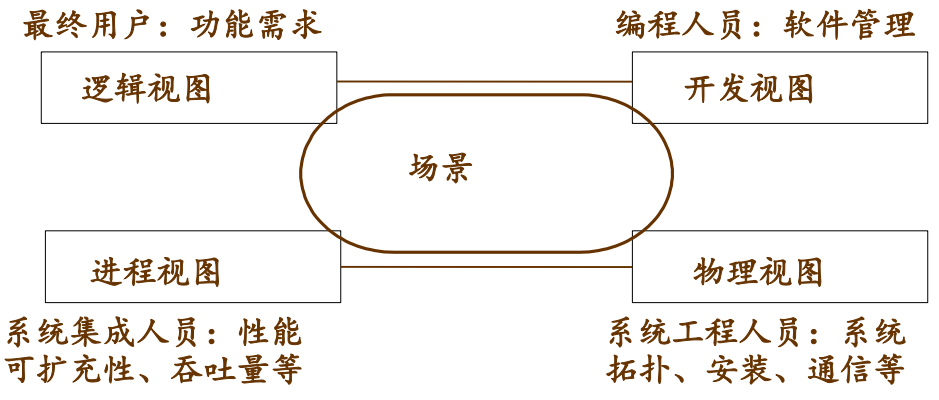
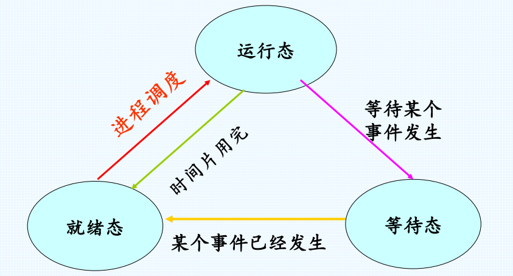

# 高级操作系统笔记

## 第一章  分布式系统简介

### 第一节 分布式系统相关概念及特性

1、 什么是分布式系统？  
一个硬件或软件组件分布在网络计
算机上，通过消息传递进行通信和动作协调的
系统。  

**举例 - Web搜索**

·        底层物理设施，它由超大数目的位于全世界多个数据中心的联网计算机组成；

·        分布式文件系统，支持超大文件，并根据搜索和其他应用的使用方式（特别是在文件中以快速而持久的速度读取）进行了深度优化；

·        相关的结构化分布式存储系统，它提供对超大数据集的快速访问；

·        锁服务，它提供诸如分布式加锁和协定等分布式系统功能；

·        编程模式，它支持对底层物理基础设施上的超大并行和分布式计算的管理。

2、分布式系统的优缺点
```
优点：
  与高性能的大型主机(Main Frame)系统相比
  经济——较高的性能价格比
  对固有分布性问题求解的适应性
  可扩充性——比较松散的构成，使得节点的增减很容易
  可靠性——自动降级运行保障，故障时不停机
  可适应性——增加了对分散用户要求协同的支持
  与分散系统相比
  共享资源、加强通信、通过负载平衡提高系统的效率
  扩充了系统能力
缺点：
  控制比较复杂，尤其是在资源管理上
  要附加许多协调操作——资源属于局部工作站
  性能、可靠性对网络的依赖性强
```


3、分布式系统主要特点
* 并发性--如何描述：程序并发、协调并发。
* 缺乏全局时钟--分布式系统中的计算机只能通过本地时钟交换消息；不可预测的消息延迟限制了准确性；没有一个全局时钟的概念。
* 故障独立性--计算机中的故障或程序中的异常马上不能被与之通讯的其他组件感知；系统设计者需要为故障处理做计划。

4、共享硬件和共享软件的例子

共享硬件：打印机

5、在分布式系统中，常常说， “避免性能瓶颈” 。可否举例说明并谈谈你的观点。


6、在故障处理（Failure handling）中，什么叫容错？什么叫冗余？  

冗余：指重复配置系统的一些部件,当系统发生故障时,冗余配置的部件介入并承担故障部件的工作,由此减少系统的故障时间。通常指通过多重备份来增加系统的可靠性。

容错：容错是用冗余的资源使计算机具有容忍故障的能力，即在产生故障的情况下，仍有能力将指定的算法继续完成。

容错技术是指在一定程度上容忍故障的技术，也称为故障掩盖技术（fault masking）。采用容错技术的系统称容错系统。

容错主要依靠冗余设计来实现，它以增加资源的办法换取可靠性。由于资源的不同，冗余技术分为硬件冗余、软件冗余、时间冗余和信息冗余。


7、拓展延伸，什么是大数据及大数据的特点
```
简单来说，大数据有4个特点：
 第一，数据体量巨大，从TB级别跃升到PB级别；
 第二，数据类型繁多，网络日志、视频、图片、地理位置信息等。
 第三，价值密度低，商业价值高。以视频为例，连续不间断监控过程中，可能有用的数据仅仅有一两秒。
 第四，处理速度快。
 这和传统的数据挖掘技术有着本质的不同。
 业界将其归纳为4个“ V”——Volume、 Variety、 Value、 Velocity。
```
### 第二节  分布式系统实例

```
1.Web搜索（ Google， Baidu）
2. 网上购物（京东网上商城）
3. 智能交通（地图服务——复杂系统）
4. 医疗保健（安全私密性）
```
### 第三节  分布式面临的挑战
```
1. Heterogeneity （异构性）
2. Openness （开放性）
3. Security （安全性）
4. Scalability （可伸缩性）
5. Failure handling （故障处理）
6. Concurrency （ 并发性）
7. Transparency （ 透明性）
8. Quality of Service （ QoS） (服务质量)


异构性。网络、计算机硬件、操作系统、编程语言、由不同的开发者完成的软件实现都是造成异构性的主因。其中网络的异构通过互联网协议相互通信而被屏蔽；中间件的流行屏蔽的底层网络、硬件、操作系统和编程语言的异构，它为分布式应用和服务器提供了一直的计算模型，包括RPC、远程事件通知、远程SQL访问和分布式事物调用；虚拟机也是使代码到处运行的一种方法。

开放性。它取决于新的资源共享服务能被增加和供多种客户程序使用的程度。特征就是发布系统的关键接口，使其基于一致的通信机制，让不同提供商提供异构硬件和软件。

安全性。包括三个部分：机密性（防止泄露给未授权的个人）、完整性（防止被改变或被破坏）、可用性（防止对访问资源的手段的干扰）。其中有两个重要的安全问题：拒绝服务攻击和移动代码的安全性仍然没有得到圆满解决。

可伸缩性。顾名思义就是随着资源数量的增加和用户访问的增加，系统仍然能保持其有效性，该系统就被称为可伸缩的。其中有控制物理资源的开销、控制性能损失、防止软件资源用尽和避免性能瓶颈四大挑战。

故障处理。在一个分布式系统中，硬件或软件都会出现未知的故障或者不正常运行，因此故障处理是贯穿整个系统的难题。容错（设计容错机制如重传）、故障恢复（数据恢复或“回滚”保证一致性）、冗余（多条路由或者备份等技术）都是故障处理技术。

并发性。多个用户对同一资源的使用，要保持操作的正确性就必须在数据保持一致的基础上同步。如使用操作系统的信号量。

透明性。
    1. 访问透明性：用相同的操作访问本地资源和远程资源（电子邮件）
    2. 位置透明性：不需要知道资源的物理位置或网络位置（电子邮件、URL）
    3. 并发透明性：几个进程能并发的使用共享资源而不互相干扰
    4. 复制透明性：使用资源的多个实例提升可靠性和性能，而用户和程序员无需知         道副本的相关信息
    5. 故障透明性：屏蔽错误
    6. 移动透明性：资源和客户能够在系统内移动而不受影响（移动电话）
    7. 性能透明性：负载变化时，系统能够被重新配置以提高性能
    8. 伸缩透明性：系统和应用能够进行扩展而不改变系统结构和应用算法
```
## 第二章  分布式系统体系结构

### 第一节 简介
1、体系结构模型
```
• 分布式系统逻辑组织——软件体系结构
• 分布式系统物理组织——系统体系结构
• 体系结构与中间件——系统透明性
• 分布式系统的自我管理——系统可适应性
• 基础模型 ——分布式系统重要模块
```

### 第二节 软件体系结构样式
1、体系结构样式： 软件架构根据组件、组件之间的连
接方式、数据交换以及这些元素如何集成到一个系
```
统来定义：
– 分层体系结构（ Layered architectures）
– 基于对象的体系结构（ Object-based architectures）
– 以数据为中心的体系结构（ Data-centered architectures）
– 基于事件的体系结构（ Event-based architectures）
```
2、软件体系结构
“4+1” 模型概述
```
Kruchten在1995年提出了“4+1” 的视图模型。
“ 4+1” 视图模型从5个不同的视角包括逻辑视
图、 进程视图、 物理视图、 开发视图和场景视图
来描述软件体系结构。
每一个视图只关心系统的一个侧面， 5个视图结
合在一起才能反映系统的软件体系结构的全部内
容
```



### 第三节 系统体系结构
系统体系结构：软件体系结构的实例，确定软
件组件、组件的交互以及它们的位置
```
• 集中式体系结构
• 非集中式体系结构
• 混合体系结构
```
1、集中式体系结构

```
客户端-服务器模型
• 服务器（ server）：实现某个特定服务的进程
• 客户（ client）：向服务器请求服务的进程
• 客户端-服务器之间的一般交互：请求/回复
• 无连接的协议：高效，受传输故障的影响，适合局域网
• 基于连接的协议：性能相对较低，适合广域网（ TCP/IP）
```
2、非集中式体系结构

```
• 垂直分布性：按逻辑把不同的组件放在不同的机器上。
• 水平分布性：客户或服务器按照在物理上被分割成逻辑上相同的
几部分:点对点系统。
```
3、分布式系统体系结构元素包括：通信实体、通信范型、角色和责任、放置，以客户-服务器系统体系结构为例解释相应元素概念。
```
通信实体 - 客户端与服务器端的通信（对象，组件，web服务），底层进程间的通信。
通信范型 - 分布式系统中实体如何通信。客户-服务器结构中最常见的通信范型是远程调用，如用于支持客户-服务器计算的请求-应答协议是一个有效的模式。
角色和责任 - 在客户-服务器结构中，进程扮演服务器和客户的角色。特别是，为了访问服务器管理的共享资源，客户进程可以与不同主机上的服务器进行交互。
放置 - 对象或服务这样的实体是怎样映射到底层的物理分布式基础设施上的，物理分布式基础设施由大量的机器组成，这些机器通过一个任意复杂的网络互联。从决定分布式系统特性的角度而言，放置是关键的，这些特性大多数与性能相关，也包括其他特性如可靠性和安全性。放置需要考虑实体间的通信模式、给定机器的可靠性和它们当前的负载、不同机器之间的通信质量等。
```

4、分布式系统模型设计时，设计者常常面对的分布式系统的困难与威胁问题有哪些？
```
1）  使用模式的多样性：
·        系统组件承受各种工作负载
例如：Web每天有几百万的访问量
·        系统断线或连接不稳定
例如：系统中包括移动计算机
·        系统对带宽与延迟的特殊要求
例如：多媒体应用
 2） 系统环境的多样性：
·        容纳异构硬件、操作系统和网络
·        网络在性能上有很大的不同
例如：无线网的速度只达到局域网的几分之一
·        支持不同规模的系统
从几十台计算机到几百万台计算机
3）   内部问题：
·        非同步时钟
·        冲突的数据更新
·        系统组件的软硬件故障
4）   外部问题：
·        数据完整性
·        保密性的攻击
·        服务拒绝攻击
```


5、什么叫瘦客户？举例说明你的观点。

瘦客户是指一个软件层，它支持用户端的计算机上基于窗口的用户界面，而在远程的计算机上执行应用程序。

### 第四节 体系结构与中间件

### 第五节 分布式系统的自我管理

### 第六节 基础模型
1、分布式系统的基础模型有哪些？分别可以解决哪些问题？


```
1)   交互模型 - 交互模型处理分布式系统中性能以及设置时间限制的困难，例如对于消息传递。反映了进程交互的方式；

2)   故障模型 - 故障模型试图给出由进程和通信通道呈现出来的故障的一个精确的规格说明。它定义可靠的通信和正确的进程；

3)   安全模型 - 安全模型讨论对于进程和通信通道可能存在的威胁，它引入了安全通道的概念，以低于这些威胁。
```
## 第三章 进程通信

### 第一节 进程和线程
1、什么是程序

2、什么是进程

进程是具有独立功能的程序关于某
个数据集合上的一次运行活动，是
系统进行资源分配和调度的独立单
位。

3、程序和进程之间的区别

```
进程更能真实地描述并发，而程序不能
进程是由程序和数据+PCB组成的
程序是静态的，进程是动态的
进程有生命周期，有诞生有消亡，短暂的；
而程序是相对长久的
一个程序可对应多个进程，反之亦然
进程具有创建其他进程的功能，而程序没有进程的三种基本状态：
进程在生命消亡前处于且仅处于三种基
本状态之一
不同系统设置的进程状态数目不同
```

4、进程的三个基本状态
```
运行态（Running）：
进程占有CPU，并在CPU上运行
就绪态（Ready）：
一个进程已经具备运行条件，但由于无CPU
暂时不能运行的状态（当调度给其CPU时，立即
可以运行）
等待态（Blocked）：阻塞态、挂起态、封锁态
冻结态、睡眠态
指进程因等待某种事件的发生而暂时不能运
行的状态 （即使CPU空闲，该进程也不可运行）
```


5、进程控制块

系统为了管理进程设置的
据结构，用它来记录进程的外
描述进程的运动变化过程

6、什么是线程

线程是指进程内的一个执行单元，也是进程内的可调度实体。

7、进程和线程之间的区别
```
(1) 地址空间: 进程内的一个执行单元； 进程至少有一个线程； 它们共享进程的地址空间； 而进程有自己独立的地址空间；

(2) 资源拥有: 进程是资源分配和拥有的单位， 同一个进程内的线程共享进程的资源

(3) 线程是处理器调度的基本单位， 但进程不是。

(4) 二者均可并发执行。

进程和线程都是由操作系统所体会的程序运行的基本单元，系统利用该基本单元实现系统对应用的并发性

进程和线程的区别在于：

简而言之，一个程序至少有一个进程，一个进程至少有一个线程。

线程的划分尺度小于进程，使得多线程程序的并发性高。

另外，进程在执行过程中拥有独立的内存单元，而多个线程共享内存，从而极大地提高了程序的运行效率。

线程在执行过程中与进程还是有区别的。每个独立的线程有一个程序运行的入口、顺序执行序列和程序的出口。但是线程不能够独立执行，必须依存在应用程序中，由应用程序提供多个线程执行控制。

从逻辑角度来看，多线程的意义在于一个应用程序中，有多个执行部分可以同时执行。但操作系统并没有将多个线程看做多个独立的应用，来实现进程的调度和管理以及资源分配。这就是进程和线程的重要区别。

进程是具有一定独立功能的程序关于某个数据集合上的一次运行活动，进程是系统进行资源分配和调度的一个独立单位。

线程是进程的一个实体，是CPU调度和分派的基本单位，它是比进程更小的能独立运行的基本单位。线程自己基本上不拥有系统资源， 只拥有一点在运行中必不可少的资源 (如程序计数器， 一组寄存器和栈)， 但是它可与同属一个进程的其他的线程共享进程所拥有的全部资源。

一个线程可以创建和撤销另一个线程；同一个进程中的多个线程之间可以并发执行。
```
8、什么是进程、线程的并发控制与调度？什么是多线程并发控制？
```
答：进程调度 - 操作系统管理了系统有限资源，当有多个进程（或多个进程发出的请求）要使用这些资源时，因为资源有限性，必须按照一定的原则选择进程（请求）来占用资源，这就是调度。

线程调度 - 指按照特定机制为多个线程分配CPU的使用权。

多线程并发控制 -是指从软件或者硬件上实现多个线程并发执行的技术。具有多线程能力的计算机因有硬件支持而能够在同一时间执行多于一个线程，进而提升整体处理性能。
```
### 第二节 进程通信（消息传递）

1、消息传递的三种常用的组合方式
```
“阻塞send， 阻塞receive”方式， 即“会
合” 原则， 适用于进程间的紧密同步
（如打电话）
“无阻塞send， 阻塞receive”方式， 最有
用的组合（如服务器提供资源， 收发短信）
“无阻塞send， 无阻塞receive”方式， 不
要求任何一方等待。 危险：信息可能会
丢失（如贴/看小广告）
```
2、消息传递的寻址

```
send原语中指明接收者是必要的
receive原语有时也指明发送者
直接寻址方案
发送者在发送时给出了接收者进程
的具体标识号， 如进程ID


间接寻址方案
发送者将消息发送到共享的信箱中临
时保管， 接收者从信箱中获得这些消
息
耦合方式： “一对一” 、 “多对一” 、
“一对多” 或“多对多”
进程与信箱的关联：静态方式（端口）
和动态方式（使用连接原语connect和
disconnect）
```
3、进程经典问题，生产者和消费者

利用线程通信机制的系统调用，实现操作系统经典的 “生产者-消费者”RPC问题的程序设计，要求写出详细的系统调用。


4、什么是进程间通信？什么是管道通信、消息队列、信号量机制、共享内存？给出定义并查阅资料举例说明。

答：进程间通信 - 指进程间的信息交换，其所交换的信息量，少则只是一个状态或一个数值，多则可能是成千上万个字节。

管道通信 - 即发送进程以字符流形式将大量数据送入管道，接收进程可从管道接收数据，二者利用管道进行通信。

消息队列 - 是在消息的传输过程中保存消息的容器。

信号量机制 - 即利用PV操作来对信号量进行处理。

共享内存 - 在多处理器的计算机系统中，可以被不同中央处理器（CPU）访问的大容量内存。

4、进程之间通讯方式

同步通信

异步通信


5、socket


6、TCP和UDP

7、什么是客户/服务器编程

从硬件角度看，客户/服务器体系结构是指将某项任务在两台或多台机器之间进行分配，其中客户机（Client）用来运行提供用户接口和前端处理的应用程序，服务器机（Server）提供客户机使用的各种资源和服务。

从软件角度看，客户/服务器体系结构是把某项应用或软件系统按逻辑功能划分为客户软件部分和服务器软件部分。客户软件部分一般负责数据的表示和应用，处理用户界面，用以接收用户的数据处理请求并将之转换为对服务器的请求，要求服务器为其提供数据的存储和检索服务；服务器端软件负责接收客户端软件发来的请求并提供相应服务。
客户/服务器融合了大型机的强大功能和中央控制以及PC机的低成本和较好的处理平衡。客户/服务器为任务的集中/局部分布提供了一种新的方法，这种体系能够使用户对数据完整性、管理和安全性进行集中控制。在缓解网络交通和主机负荷以及满足用户需要方面，客户/服务器体系提供了良好的解决方案。
总之，客户/服务器的工作模式是：客户与服务器之间采用网络协议（如TCP/IP、IPX/SPX）进行连接和通讯，由客户端向服务器发出请求，服务器端响应请求，并进行相应服务。


### 第三节 socket 编程应用实例


```

```


```

```


```

```


```

```


